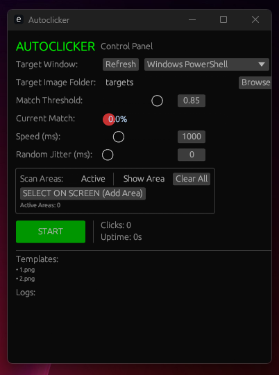
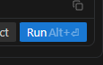
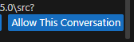

# Autoclicker (Antigravity)







A high-performance, template-based automation tool built with Rust. This version is specifically optimized for **Antigravity** workflows, featuring background interaction and precise color-aware template detection.

## Multi-Platform Support

Designed to be truly cross-platform, this tool utilizes specialized libraries to ensure functionality across different operating systems:

- **Windows**: Optimized with Win32 API for background execution (clicking without stealing focus) and advanced transparent overlays.
- **macOS & Linux**: Full support for screen scanning and input simulation using cross-platform drivers.

## Core Features

- **Background Execution**: On Windows, it uses virtual click injection (`SendNotifyMessageW`) to interact with target windows while they are in the background.
- **ROI (Region of Interest) Scanning**: Define specific screen coordinates to scan, reducing CPU usage and increasing detection speed.
- **Antigravity Optimized Detection**: Integrated logic to prioritize specific pixel patterns (such as blue-dominant colors), ensuring high accuracy for targeted interface elements.
- **Live ROI Overlay**: Interactive on-screen selection tool to visually map and monitor your automation areas.
- **Real-Time Confidence Tracking**: Visual "Match Threshold" feedback to monitor detection accuracy in real-time.
- **Variable Timing**: Adjustable speed and random jitter to maintain consistent yet natural interaction patterns.

## Getting Started

### Prerequisites

- [Rust](https://www.rust-lang.org/tools/install) (Stable)
- Windows, macOS, or Linux.

### Installation

1. Clone this repository:
   ```bash
   git clone <repository-url>
   cd Autoclicker
   ```
2. Build the optimized binary:
   ```bash
   cargo build --release
   ```

### Usage

1. **Prepare Targets**: Place target `.png` images in the `targets/` folder.
2. **Launch**:
   ```bash
   cargo run --release
   ```
3. **Setup**:
   - Select the target window from the dropdown.
   - Adjust **Match Threshold** (Default 0.85).
   - Use **SELECT ON SCREEN** to define your scanning regions.
   - Press **START** or use the **F5** hotkey to begin. (Press **F6** to stop).

## Technical Specifications

- **Engine**: Rust 1.70+
- **GUI Framework**: `eframe` (egui)
- **Capture**: `xcap` for cross-platform frame acquisition.
- **Input Simulation**: `enigo` (Generic) and Win32 (Advanced Windows Support).
- **Hotkeys**: `rdev` for global listener support.

## Configuration

- **Speed (ms)**: Base interval between scans.
- **Random Jitter (ms)**: Maximum random delay added to the base speed to prevent rigid timing.
- **Match Threshold**: Detection sensitivity (0.1 to 1.0).

---
*Note: This tool is designed for precision automation and should be used according to the target application's terms of service.*
